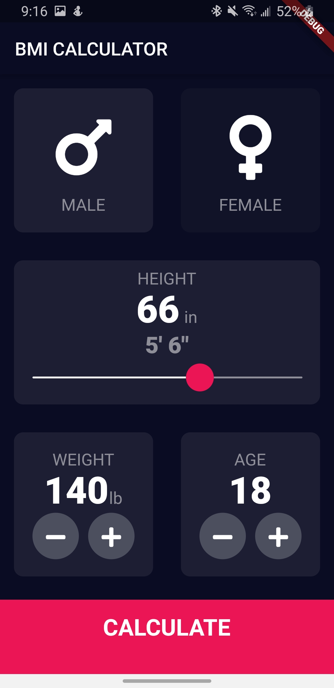
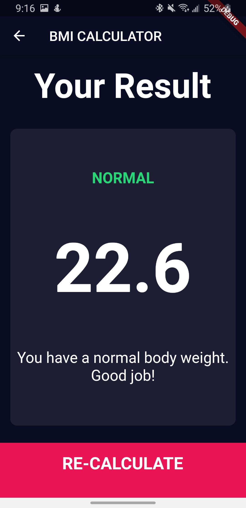
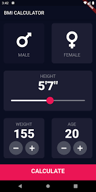

# BMI SENSE

# framework
~ Flutter framework

## Screenshots

  | Screen 1                                                   | Screen 2                                                | Screen 1                                                   |
| -------------------------------------------------------------- | ----------------------------------------------------------------------- | -------------------------------------------------------------------- |
|  |  |  |

